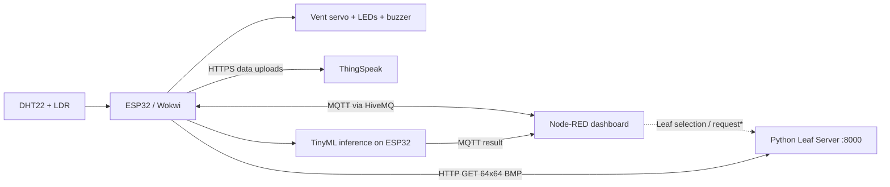

# Smart Greenhouse Automation System (SGAS)

**ESP32 · Wokwi · TinyML · MQTT · Node-RED · ThingSpeak · Python**

An IoT-based smart greenhouse prototype that monitors environmental conditions, automatically controls simulated greenhouse equipment, sends live telemetry to a dashboard, and classifies leaf images as **healthy** or **diseased** using a TinyML model running on the ESP32.

> **Project status:** Educational prototype developed using Wokwi simulation. The plant classifier is a demonstration model, not a diagnostic tool for real crops.

## Features

- **Environmental monitoring:** DHT22 temperature and humidity, plus an LDR light sensor.
- **Local automation:** Servo-controlled ventilation, simulated heater, humidifier, grow light, and fault buzzer.
- **Adaptive control:** Hysteresis to reduce repeated actuator switching; faster control updates during abnormal conditions.
- **Live monitoring:** MQTT telemetry sent to a Node-RED dashboard.
- **Cloud logging:** Periodic ThingSpeak updates and historical charts.
- **Edge AI:** On-device, binary healthy/diseased image classification using an INT8 TensorFlow Lite Micro model.
- **Local image delivery:** A Python Leaf Server serves images to the Wokwi-simulated ESP32 over HTTP.

## Architecture



\*The dashboard-to-server upload/selection mechanism depends on the exported Node-RED flow and Leaf Server implementation. The ESP32 image-download and MQTT message formats are documented below.

### Components

| Component             | Purpose                                                                    |
| --------------------- | -------------------------------------------------------------------------- |
| Wokwi + ESP32         | Simulates the embedded controller, sensor inputs, actuators, and inference |
| Python Leaf Server    | Provides leaf images to the ESP32 on local port **8000**                   |
| HiveMQ public broker  | Relays telemetry, classification commands, and results                     |
| Node-RED              | Imports the supplied JSON flow and provides the monitoring interface       |
| ThingSpeak            | Stores periodic sensor and actuator data for historical analysis           |

## Repository layout

> The paths below are a **suggested layout**. Adjust them if the files in this repository use different names or folders.

```text
smart-greenhouse/
├── src/
│   ├── main.ino                 # ESP32 firmware
│   ├── model_data.h            # Embedded TinyML model (required)
│   └── secrets.example.h       # Optional credential template
├── leaf-server/
│   └── <server-script>.py       # Replace with the actual server filename
├── node-red/
│   └── dashboard.json          # Exported Node-RED flow
├── diagram.json                # Wokwi circuit diagram
├── wokwi.toml                  # Wokwi VS Code configuration
├── platformio.ini              # ESP32 build environment and dependencies
├── .gitignore
└── README.md
```

**Do not commit** real API keys, `.env`, `secrets.h`, `.pio/`, Python virtual environments, or `__pycache__/`. The README assumes the Python server and Node-RED JSON are actually included in the repository.

## Prerequisites

- [Git](https://git-scm.com/)
- [Visual Studio Code](https://code.visualstudio.com/) with the **PlatformIO IDE** and **Wokwi Simulator** extensions (or an equivalent way to build and simulate the project)
- [Python 3](https://www.python.org/downloads/) for the Leaf Server
- [Node.js](https://nodejs.org/) and [Node-RED](https://nodered.org/docs/getting-started/local)
- Internet access for the MQTT broker and ThingSpeak
- A ThingSpeak channel and **Write API Key** if cloud logging is required

## Getting started: running the full system

The system has **three running processes**: the Leaf Server, Node-RED, and the ESP32 Wokwi simulation. Keep them running during a demonstration.

### 1. Clone the repository

Open a terminal and run:

```bash
git clone https://github.com/<YOUR-USERNAME>/smart-greenhouse.git
cd smart-greenhouse
```

Replace `<YOUR-USERNAME>` with the GitHub account hosting this repository.

### 2. Configure the ESP32 firmware

Open the repository folder in VS Code. Ensure the project contains `platformio.ini`, the circuit description, and `src/model_data.h` (the embedded model used by `main.ino`).

Check these settings in `src/main.ino`:

```cpp
const char *WIFI_SSID = "Wokwi-GUEST";
const char *WIFI_PASSWORD = "";

const char *MQTT_BROKER = "broker.hivemq.com";
const uint16_t MQTT_PORT = 1883;
const char *MQTT_TELEMETRY_TOPIC = "your_topic/telemetry";
const char *MQTT_COMMAND_TOPIC = "your_topic/command";
const char *MQTT_CLASSIFICATION_TOPIC = "your_topic/classification";
```

Replace the `your_topic` prefix with a **unique** prefix and configure the same topics in Node-RED. Using a unique prefix reduces accidental interference between users of the public broker.

**ThingSpeak configuration:** The publicly shared firmware contains a placeholder for `THINGSPEAK_WRITE_API_KEY`; it **will not upload** to ThingSpeak until a valid key is supplied. To keep a local working key out of Git history, the recommended setup is:

1. Copy `src/secrets.example.h` to `src/secrets.h` (if the example file is included).
2. Put your real key in `src/secrets.h`.
3. Keep `secrets.h` in `.gitignore` and check that it is not already Git-tracked.

If the repository does not include `secrets.example.h`, create it as a template containing:

```cpp
#pragma once
const char* THINGSPEAK_WRITE_API_KEY = "INSERT_YOUR_THINGSPEAK_WRITE_API_KEY";
```

### 3. Start the Python Leaf Server

The ESP32 firmware downloads images using URLs in this format:

```text
http://host.wokwi.internal:8000/leaves/<16-character-leaf-id>.bmp
```

This means the Leaf Server must:

- Run on your computer and listen on **port 8000**.
- Serve a file at `GET /leaves/<leaf-id>.bmp`.
- Return an **uncompressed, 24-bit BMP** image sized exactly **64 × 64 pixels**.
- Use **16 lowercase hexadecimal characters** for the leaf ID used by the dashboard's classification command.

Open **Terminal 1** in VS Code or a separate terminal:

```bash
cd leaf-server
python leaf_server.py
```

On Windows, `py leaf_server.py` may be used instead of `python leaf_server.py`.

**Important:** If the repository contains a `requirements.txt`, install it first using `python -m pip install -r requirements.txt` from the appropriate directory. Consult the server source for any additional configuration.

**Verify the server:** After creating/selecting a valid leaf ID using your server's workflow, open this address on the host computer:

```text
http://localhost:8000/leaves/<leaf-id>.bmp
```

A successful response should download or display the corresponding BMP image. Starting a server alone does not create leaf images; the server needs image data and the matching ID.

**Why `host.wokwi.internal`?** Inside the simulated ESP32, this hostname refers to the computer running the local server **when Wokwi's private IoT gateway is enabled**. On your computer, use `localhost:8000` instead. See the [Wokwi networking guide](https://docs.wokwi.com/guides/esp32-wifi).

### 4. Start Node-RED and import the dashboard

Open **Terminal 2** and run:

```bash
node-red
```

If Node-RED has not been installed, follow the [official Node-RED installation instructions](https://nodered.org/docs/getting-started/local). A typical npm installation uses `npm install -g node-red`.

Open the Node-RED editor:

```text
http://localhost:1880
```

To import the supplied JSON:

1. In the Node-RED editor, open the top-right menu (**☰**).
2. Select **Import**.
3. Choose the `node-red/dashboard.json` file (or its actual filename).
4. Import the flow into a new tab or your existing workspace.
5. Install any **missing node packages** reported by Node-RED through **Menu → Manage palette**. The required dashboard package depends on the node types inside the exported JSON (for example, classic Dashboard versus FlowFuse Dashboard 2.0).
6. Open the imported **MQTT broker configuration node** and confirm the host is `broker.hivemq.com`, port `1883`, and its client ID does not collide with another client.
7. Verify that MQTT topics in the flow match the values in `main.ino`.
8. Check for any server URL or port settings in HTTP nodes; update them to match the Leaf Server and how the flow reaches it.
9. Click **Deploy**.

See the official [Node-RED flow import guide](https://nodered.org/docs/user-guide/editor/workspace/import-export).

**Open the dashboard:**

- If the JSON uses **FlowFuse Dashboard 2.0**, the default dashboard path is usually `http://localhost:1880/dashboard`.
- If it uses the older **node-red-dashboard**, the default dashboard path is usually `http://localhost:1880/ui`.
- If the imported flow configures a custom base path, use that path instead.

The exact dashboard page structure and image-upload controls depend on `dashboard.json`.

### 5. Build and run the Wokwi ESP32 simulation

1. Keep **Terminal 1 (Leaf Server)** and **Terminal 2 (Node-RED)** running.
2. Open the project in VS Code and build its ESP32 firmware using PlatformIO.
3. Start the simulation with the **Wokwi Simulator** extension and its `wokwi.toml` configuration.
4. Ensure the **Wokwi Private IoT Gateway** is available/enabled, so the firmware can access `host.wokwi.internal:8000`.
5. Open the ESP32 Serial Monitor at **115200 baud**.
6. Wait for the firmware to initialize the TinyML model, join `Wokwi-GUEST`, connect to HiveMQ, and begin publishing telemetry.

Expected startup output includes messages similar to:

```text
TinyML model loaded successfully.
TinyML: READY
Connected to HiveMQ!
Subscribed to: <your-command-topic>
MQTT telemetry published.
```

The exact ordering can differ during connection retries. Check the serial output for any `ERROR` messages.

### 6. Monitor the greenhouse

Open the Node-RED dashboard in a browser while the ESP32 simulation is running. Its widgets, if wired to the telemetry topic, can display current temperature, humidity, light level, automation state, and actuator status.

The firmware publishes telemetry about every **2 seconds**, in this JSON structure:

```json
{
  "temperature": 25.0,
  "humidity": 55.0,
  "light": 1800,
  "state": "NORMAL",
  "vent": false,
  "heater": false,
  "humidifier": false,
  "growLight": false,
  "alert": false
}
```

The values above are illustrative. Actual readings come from the simulated sensors.

Change the simulated sensor values in Wokwi to test the control logic. The LEDs represent greenhouse hardware: **red = heater**, **blue = humidifier**, **green = grow light**; the servo represents ventilation, and the buzzer indicates a sensor fault.

### 7. Run TinyML leaf disease classification

The image-classification workflow is controlled through MQTT. In general:

1. Start the Leaf Server, Node-RED, and Wokwi simulation.
2. Use the leaf-selection/upload mechanism provided by the Leaf Server and imported Node-RED flow to register a leaf image and obtain its **16-character lowercase hex ID**. The exact UI steps depend on those two files.
3. The dashboard must publish the following **plain-text** command to the configured MQTT command topic:

```text
CLASSIFY:0123456789abcdef
```

4. The ESP32 checks the command, constructs the image URL, downloads the corresponding **64×64 uncompressed 24-bit BMP** from the Leaf Server, and runs its embedded model.
5. It publishes status and results to the classification MQTT topic.

**Example completed result:**

```json
{
  "leafId": "0123456789abcdef",
  "status": "done",
  "prediction": "DISEASED",
  "probability": 0.8730
}
```

Here, `probability` is the model's **disease-class probability**, not a general guarantee of correctness. A value **≥ 0.5** results in `DISEASED`; below that, `HEALTHY`. The firmware also reports `status: "running"` or `status: "error"` and an error message when appropriate.

**Technical detail:** Inference runs on the **ESP32**, not on the Python Leaf Server. The server supplies an image; the firmware handles pixel conversion, INT8 quantization, and model inference.

### 8. View historical data in ThingSpeak (optional)

1. Create a channel on [ThingSpeak](https://thingspeak.mathworks.com/).
2. Configure the channel fields as shown below.
3. Supply your **own** Write API Key in the local firmware configuration and restart the simulation.
4. Open your channel's **Private View** (or a public view only if you deliberately made the channel public).

| ThingSpeak field | Data                       |
| ---------------- | -------------------------- |
| Field 1          | Temperature (°C)           |
| Field 2          | Humidity (%)               |
| Field 3          | Light ADC reading          |
| Field 4          | Vent open (`0` or `1`)     |
| Field 5          | Heater on (`0` or `1`)     |
| Field 6          | Humidifier on (`0` or `1`) |
| Field 7          | Grow light on (`0` or `1`) |
| Field 8          | Sensor fault (`0` or `1`)  |

The firmware attempts uploads about every **20 seconds** once ready (first eligible attempt after approximately 10 seconds). Look for `ThingSpeak HTTP response:` and an entry ID in the Serial Monitor to diagnose uploads.

## Local automation rules

| Condition                     | System response                                                   |
| ----------------------------- | ----------------------------------------------------------------- |
| Temperature **> 30°C**        | Open vent (unless cold condition takes priority)                  |
| Temperature **< 18°C**        | Turn on heater and close vent                                     |
| Humidity **> 80%**            | Open vent unless the greenhouse is cold                           |
| Humidity **< 40%**            | Turn on humidifier                                                |
| LDR reading **> 2500**        | Turn on grow light                                                |
| DHT22 invalid or out of range | Set `ALERT`, disable DHT-dependent actuators, and activate buzzer |

The thresholds use **hysteresis**: hot clears below 27°C, cold clears above 20°C, humid clears below 70%, dry clears above 50%, and low light clears below an ADC reading of 1800. More than one condition can be active at a time. The control loop switches between about **2,000 ms** in normal conditions and **500 ms** during alerts or abnormal states; physical DHT readings remain limited to every **2,000 ms**.

## MQTT reference

All three topics use the same configurable prefix in `main.ino` and Node-RED:

| Direction         | Topic suffix      | Payload                                         |
| ----------------- | ----------------- | ----------------------------------------------- |
| ESP32 → dashboard | `/telemetry`      | JSON environmental readings and actuator states |
| Dashboard → ESP32 | `/command`        | `CLASSIFY:<16 lowercase hex characters>`        |
| ESP32 → dashboard | `/classification` | JSON status, prediction, probability, or error  |

The firmware currently uses `broker.hivemq.com:1883` without MQTT authentication or TLS. This is suitable only for a non-sensitive demo; do not expose real equipment or sensitive information through the public command topic.

## Troubleshooting

- Wokwi cannot download image: Is the Leaf Server running on port 8000? Is Wokwi using the private IoT gateway? Does `GET /leaves/<id>.bmp` return a valid BMP?
- HTTP 404 when classifying: The server does not have an image associated with the requested leaf ID.
- `Image must be 64x64`: Resize/convert the leaf image to **64 × 64** BMP.
- `Image must be uncompressed 24-bit BMP`: Convert the image to uncompressed **24-bit RGB BMP**.
- Dashboard shows no data: Check Node-RED Deploy status, MQTT broker settings, exact topic names, and Wokwi Serial Monitor.
- TinyML initialization fails: Check `model_data.h`, INT8 model input/output shape, and available ESP32 heap.
- No ThingSpeak updates: Verify the local Write API Key, channel field setup, Wi-Fi connectivity, and HTTP response/entry ID.
- Node-RED reports missing nodes: Install the packages required by the imported flow using **Manage palette**.
- Wokwi simulation runs but cannot see host server: Confirm `host.wokwi.internal` resolves through the **Private IoT Gateway**, not a browser-only public network configuration.

## Security notes

- **Never commit** an actual ThingSpeak Write API Key, MQTT credentials, or other secrets.
- `.gitignore` stops new untracked secret files from being committed; it does **not** erase any secrets already in Git history. Rotate previously exposed keys.
- The example MQTT transport uses the **public unencrypted HiveMQ broker on port 1883**; real deployments should use authenticated TLS connections and access controls.
- The current ThingSpeak HTTPS code calls `client.setInsecure()`, which disables server certificate verification. Configure certificate validation for production use.
- Keep leaf-upload endpoints restricted and validate image contents/size in the Python server when extending the prototype.


## Project scope and limitations

This is a **simulation-first educational project**. Control outputs are simulated hardware, the leaf model performs **binary classification**, and reliable model accuracy depends on the training data and testing procedure. The image server and Node-RED flow are needed for the end-to-end image demo. The trained model itself must be included as `model_data.h` to reproduce firmware inference.

## Further reading

- [Wokwi ESP32 Wi-Fi and local host networking](https://docs.wokwi.com/guides/esp32-wifi)
- [Wokwi for VS Code project configuration](https://docs.wokwi.com/vscode/project-config)
- [Node-RED: Importing and exporting flows](https://nodered.org/docs/user-guide/editor/workspace/import-export)
- [Node-RED: Getting started locally](https://nodered.org/docs/getting-started/local)
- [ThingSpeak](https://thingspeak.mathworks.com/)